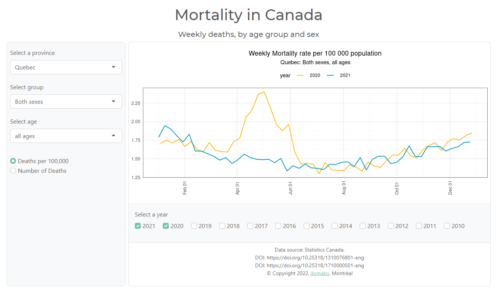

## Mortality in Canada: Explore weekly deaths, by age group and sex
### <a href="https://jlomako.shinyapps.io/mortality-canada/"> >> Open app</a>

This Shiny app visualizes weekly death data from Statistics Canada. 

In the app, you can switch between "Number of deaths" and 
"Deaths per 100.000". You can select the years you want to visualize, 
the province or territory, and the sex and age group. The app is interactive and mobile friendly.
It was written in R and is hosted on shinyapps.io.

The app uses data from Statistics Canada Table 13-10-0768-01: 
Provisional weekly death counts, by age group and sex
(DOI: https://doi.org/10.25318/1310076801-eng) and
Table 17-10-0005-01: Population estimates 
(DOI: https://doi.org/10.25318/1710000501-eng).

### Preview:

